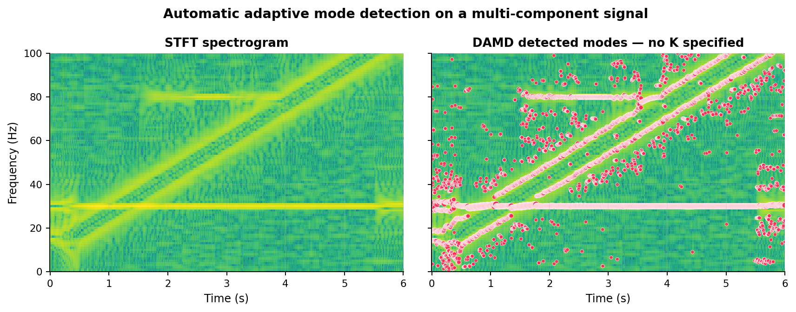
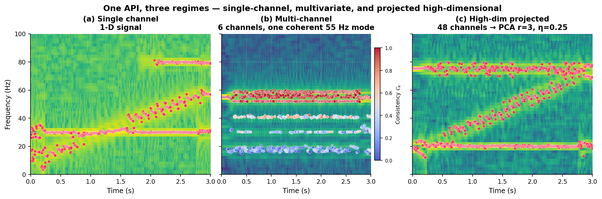

# DAMD — Density-based Adaptive Mode Decomposition

`damd` is a Python package for automatic, adaptive decomposition of
non-stationary signals into constituent oscillatory modes. A single
class, `DAMD`, handles single-channel, multivariate, and high-
dimensional signals through the same interface.



*Left:* a non-stationary signal with three components — a stable
30 Hz tone, a 10 → 60 Hz chirp, and an intermittent 80 Hz burst.
*Right:* DAMD's detected mode centres overlaid on the spectrogram. No
mode count was specified; the algorithm inferred the structure from
the data.

This repository is the reference implementation accompanying:

1. H. Jia, C. Yang, C. F. Caiafa, Z. Sun, F. Duan, J. Solé-Casals.
   **"Density-based Adaptive Mode Decomposition."**
   *IEEE Transactions on Signal Processing*, 2026.
2. H. Jia, C. Yang, F. Feng, C. F. Caiafa, F. Duan, J. Solé-Casals.
   **"Multivariate Density-based Adaptive Mode Decomposition."**
   2026. (under submission)

## One API, three regimes



The same `DAMD(...)` constructor handles (a) a single-channel signal,
(b) a multi-channel signal — with per-mode cross-channel consistency
reported automatically (red = shared across channels, blue =
channel-specific) — and (c) a high-dimensional signal reduced to a
rank-*r* subspace via PCA before clustering. The paper experiments
and the `experiments/` folder reproduce the formal benchmarks on all
three cases.

## Highlights

- **Automatic mode-count detection.** Meanshift clustering on the
  aggregated power spectrum finds the right number of modes without
  manual tuning — no `K` to pick.
- **Perfect reconstruction** under the hard-partition construction:
  the sum of extracted modes reproduces the original signal bin-for-
  bin.
- **One class, three regimes.** The same `DAMD` constructor handles
  1-D signals, multi-channel aggregation, and high-dimensional
  projected decomposition (just set `r=…` for a rank-`r` PCA
  projection, or pass your own orthonormal basis `U`).
- **Four time-frequency representations.** STFT, CWT, and their
  synchrosqueezed variants share a common pipeline.
- **Baselines included.** Pure-NumPy implementations of VMD, MVMD and
  STVMD (all derived from a shared ADMM core) for side-by-side
  comparison; no external dependency on `vmdpy` or similar packages.
- **NumPy / SciPy only.** No GPU backends, no `torch`, no `jax`,
  no `numba`. Runs anywhere a scientific-Python stack runs.

## Installation

```bash
pip install damd
# or, for the paper experiments / plotting
pip install "damd[viz]"
```

From source:

```bash
git clone https://github.com/plustar/Density-based-Adaptive-Mode-Decomposition.git
cd Density-based-Adaptive-Mode-Decomposition
pip install -e ".[viz]"
```

## Quick start

### Single-channel

```python
import numpy as np
from damd import DAMD

fs, N = 256, 1024
t = np.arange(N) / fs
x = 0.2 * np.sin(2 * np.pi * 50 * t) + 0.5 * np.random.randn(N)

res = DAMD(fs=fs, transform='stft', n_fft=128).fit(x)
print(res.summary())
# → mean 11 modes per frame, 50 Hz detected in every frame
```

### Multi-channel (MDAMD)

```python
# X has shape (d, N) for d channels
res = DAMD(fs=fs, transform='ssq_stft').fit(X)

# Per-frame cross-channel consistency (Def 4 of the MDAMD paper)
res.consistency   # list of length T, each (K_t,) in [0, 1]
```

### High-dimensional projection

```python
# Project d-channel signal to rank r before clustering
res = DAMD(fs=fs, r=4).fit(X)      # X: (64, N), r=4

res.U                 # (64, 4) orthonormal PCA basis
res.energy_retention  # η from Def 7 of the MDAMD paper

# Or supply your own orthonormal projection
my_U = np.linalg.qr(np.random.randn(64, 6))[0]
res = DAMD(fs=fs, U=my_U).fit(X)
```

### Selecting modes by energy

```python
# Drop modes whose energy falls below the 30th percentile
filtered = res.filter_energy(percentile=30)
```

### Baselines for comparison

```python
from damd.baselines import vmd, mvmd, stvmd

r = vmd(x, K=3, fs=fs)                    # classical VMD
r = mvmd(X, K=3, fs=fs)                   # shared centres across channels
r = stvmd(x, K=3, fs=fs,                  # dynamic time-varying centres
          window_length=256, dynamic=True)
```

All three share the same ADMM core (`damd.baselines._admm`) — no
external dependency.

### HVR refinement

Hybrid Variational Refinement uses DAMD's mode centres as VMD
initialisation, only running VMD on frames where modes are too close
to be cleanly separated by clustering alone:

```python
from damd import hvr

dme = DAMD(fs=fs).fit(x)
hvr_res = hvr(per_frame_signals,
              dme.centers,
              list(dme.bandwidth),
              fs=fs, eta_refine=2.0)
```

## Package layout

```
damd/
  core/         # building blocks: meanshift, bandwidth, aggregate,
                # reducers (PCA / Precomputed), metrics, windows
  tfmaps/       # STFT, CWT, SSQ-STFT, SSQ-CWT — forward + inverse
  baselines/    # VMD, MVMD, STVMD (shared ADMM core)
  hvr.py        # Hybrid Variational Refinement
  damd.py       # DAMD main class
  viz/          # matplotlib helpers
  tests/        # pytest suite

experiments/
  common/            # reference signal generators + plot styling
  damd_paper/        # reproduces §III of the DAMD paper
  mdamd_paper/       # reproduces §VIII of the MDAMD paper (both the
                     # multivariate and the high-dimensional cases)
```

## Reproducing the papers

Each experiment script is self-contained and writes its figures /
tables into `experiments/<paper>/figures/` (or stdout).

```bash
python -m experiments.damd_paper.run_all
python -m experiments.mdamd_paper.run_all
```

The banner figures at the top of this README are themselves
reproducible — run `python assets/make_figures.py` to regenerate
`assets/hero.png` and `assets/three_regimes.png`.

Notable scripts:

- `damd_paper/exp_a_decomposition.py`  — Fig 1, full pipeline
  visualisation
- `damd_paper/exp_c_transforms.py`     — Fig 5/6 + Table I, four
  time-frequency representations
- `damd_paper/exp_d_hvr.py`            — Fig 7 + Table II, DME vs HVR
  vs VMD
- `mdamd_paper/exp_b_equivalence.py`   — Table IV, validating
  Theorem 1 + Proposition 3
- `mdamd_paper/exp_d_snr.py`           — Table VI, projection SNR
  enhancement (Proposition 5)
- `mdamd_paper/exp_e_comparison.py`    — Table VII, DAMD vs MVMD vs
  STVMD detection performance
- `mdamd_paper/exp_f_highdim.py`       — §VIII-F, 64-channel
  projection case

## Design choices worth flagging

- The main class API is **one constructor**. What the MDAMD paper
  draft called "GDAMD" is not a separate class here — passing
  `r < d` simply activates the projection path.
- SSQ inverse reconstructions are **approximate**. For exact mode
  inversion, use `DAMD.reconstruct(...)`, which performs
  hard-partition inversion on the non-squeezed representation.
- Energy filtering is **post-hoc**: modes are always reported in
  full, then `res.filter_energy(percentile=…)` trims them. This keeps
  the initial partition faithful to the theoretical guarantees
  (Theorem II.1).

## Citing

```bibtex
@article{jia2026damd,
  title   = {Density-based Adaptive Mode Decomposition},
  author  = {Jia, H. and Yang, C. and Caiafa, C. F. and
             Sun, Z. and Duan, F. and Sol{\'e}-Casals, J.},
  journal = {IEEE Transactions on Signal Processing},
  year    = {2026}
}

@article{jia2026mdamd,
  title   = {Multivariate Density-based Adaptive Mode Decomposition},
  author  = {Jia, H. and Yang, C. and Feng, F. and Caiafa, C. F. and
             Duan, F. and Sol{\'e}-Casals, J.},
  year    = {2026},
  note    = {under submission}
}
```

## License

MIT. See `LICENSE` for details.
